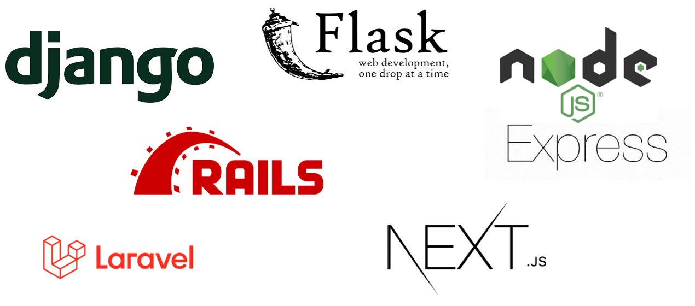
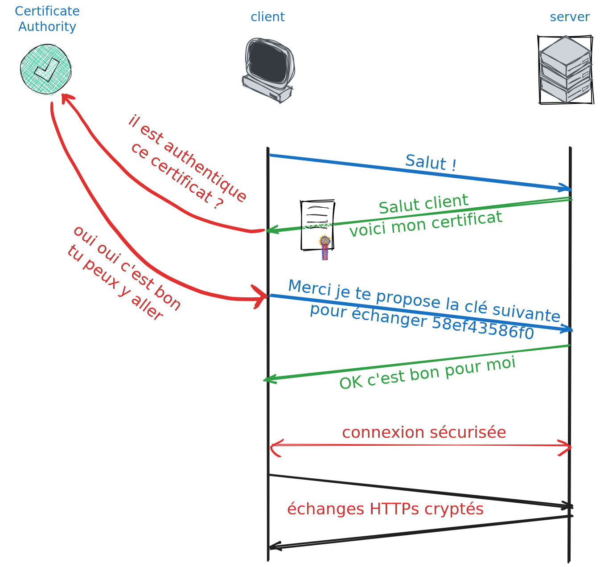

class: middle, slide_title


<!--  -->


# Programmes coopérants 🚀

## Côté Serveur !

<p> <strong><i>Basile Marchand</i></strong><sup> 1</sup></p>

.footnote[1 - Plateforme SISDev, Centre des Matériaux, MINES Paris - CNRS - Université PSL]

---

layout: true


<!--  -->

<div class="slide_footer">
    <div class="wrap">
        <span>2025 - <i> Réseaux & Backend</i> - 2/3: Coté Serveur! </span>
    </div>
</div>

---

# Récap de la semaine dernière

.center[Architecture classique Client <-> Serveur avec des variations peer-to-peer, three-tier, ... ]

.cols[
.fifty[
.center[]
]
.fifty[
Un modèle OSI en 7 couches

.center[]

Un protocole HTTP(S) pour le web

.center[

]

]
]

---

# Quel est le rôle du serveur ?

.center[

]

--

.center[🥱 Attendre et attendre et attendre ... 🥱]

--

Et de temps en temps 🥳 il doit traiter une requête !

---

class: center, middle

# Serveur et serveur deux choses différentes

**_Attention_** il y a deux significations à serveur ...

.center[

<iframe src="https://giphy.com/embed/xU9TT471DTGJq" width="480" height="365" frameBorder="0" class="giphy-embed" allowFullScreen></iframe>
]

---

# Serveur et serveur deux choses différentes

## Le serveur hardware

.center[

]

.center[C'est la machine **physique ou virtuelle** connectée au réseau qui va recevoir des paquets de données mais en aucun cas ne s'occupera du traitement de ces données]

---

# Serveur et serveur deux choses différentes

## Le serveur hardware : différents types

.center[Serveur physique vs serveur virtuel (VPS) ]

<div style="position: absolute; bottom: 15%; left: 15%">

</div>

--

<div style="position: absolute; bottom: 15%; right: 10%">

</div>

--

<div style="position: absolute; bottom: 10%; left: 20%">
Différentes solutions : On Premise vs Cloud (OVH, Azure, GCP, AWS, ... )
</div>

---

# Serveur et serveur deux choses différentes

## Le serveur "software"

.center[

]

C'est l'application (au sens logiciel) qui va s'occuper de

.center[**Recevoir**, **Traiter** et **Répondre** aux requètes HTTP (ou autres d'ailleurs)]

Différentes solutions : Apache (40%), Nginx (20%), IIS (10%), ...

.footnote[Source : [https://fr.hostadvice.com/marketshare/server/](https://fr.hostadvice.com/marketshare/server/) ]

---

# Héberger plusieurs serveurs HTTP(S) sur un même serveur physique ?

.center[OUI 🎯 il suffit de se partager le port 80 🤝]

.center[]

--

.center[Il suffit de configurer au niveau du serveur HTTP des **Virtual Host**]

--

<div style="position: absolute; top: 38%; left:15%">

</div>

<div style="position: absolute; top: 38%; left:55%">

</div>

.center[
le "routage" entre les deux sites se fait au niveau du Header `Host:` de la requête HTTP
]
---

# Un mot sur le serverless

.center[Un serveur traditionnel passe son temps à attendre ...

🥱

]

.center[**_Un serve rless est un serveur qui n'attend pas_**]

Le principe est de découper le traitement en petites **tâches indépendantes** (fonctions) qui seront exécutées **à la demande**

.cols[
.fifty[

## Avantages

- Pas de gestion de serveur
- Pas de coût fixe
- Évolutif

]
.fifty[

## Inconvénients/Difficultés

- Temps de démarrage
- Coût à l'usage
- Difficulté de débogage
- Stateless

]
]

Coût plus faible pour les fournisseurs car ils peuvent optimiser l'utilisation des ressources

---

# Tous les serveurs font la même chose ?

**Deux applications**

.center[Sites statiques vs dynamiques]

.cols[
.fifty[

<iframe src="https://cpp.bmarchand.fr/controlSection.html" width="100%" height="400px" frameBorder="0"></iframe>

    ]

.fifty[

<iframe width="100%" height="400px" src="https://xkcd.com"></iframe>

    ]

]

---

# Site statique

.center[Le serveur http ne fait qu'une seule et unique chose
<br><br>
**_lire des fichiers_** html, png, jpg, pdf, .... et **_envoyer le contenu au client_**
]

<br><br>

.center[
<a href="http://cpp.bmarchand.fr" target="_blank"> </a>
]

---

# Site dynamique

.center[Le serveur http va devoir travailler **avec d'autres services** <br>afin de produire le résultat final pouvant être envoyé au client]

.center[
<a href="http://bmarchand.fr/research/activities" target="_blank">

</a>
]

--

.center[
<a href="https://rep.mines-paristech.fr" target="_blank">

</a>
]

---

# Solutions d'hébergement gratuit

.cols[
.fifty[

## Sites statiques

- GitHub Pages (nous y sommes !)
- readthedocs.io (les cours de S1)
- GitLab Pages
- Netlify
- Vercel
- ...

]
.fifty[

## Sites dynamiques

- ~~Heroku~~
- Glitch
- Repl.it
- PythonAnywhere
- Vercel (serverless)
- ...

]

]

.center[Plein d'offres sur le marché, à vous de choisir celle qui vous convient le mieux]

Attention en revanche :

.center[**_Gratuit_** ne veut pas dire **_sans limite_**]

---

# Le serveur web : un besoin de perf 🚀

.cols.bottom[

.sixty[
  
]

.fourty[
  Comment faire pour que tout le monde

  ait une réponse en un temps raisonnable ?

  ⏳️
]

]

---

# Solutions techniques

.center[]

.center[Utilisation du parallélisme de tâches processus/thread et/ou programmation asynchrone]

---

# Et au fait il répond quoi le serveur à GET ?

.cols[
.fifty[
.center[]
]
.fifty[
.center[]
]
]

<br><br>
Possible de voir les requêtes et réponses dans votre navigateur via
`Outils de développement > Network`

--

<div style="position: absolute; top: 38%; left:15%">

</div>

<div style="position: absolute; top: 38%; left:55%">

</div>

---

# Faisons un serveur http de base

```sh
# dans votre terminal:
# on va dans le repo du cours
cd /bla-bla-bla/backend

# pour lancer le serveur
python -m http.server
# ... à ce stade le terminal est bloqué
# pour tuer le serveur tapez "Control-C"
```

puis ouvrez dans votre navigateur `http://localhost:8000/index.html` (*)

--

.cols[

.cols.center.fourty[
  On peut aussi le faire "à la main" en Python 🐍

  📢 ⚠️ On regarde le fichier `minimal_server.py`

  ```bash
  $ cd python/
  $ python minimal_server.py
  ```
]

.sixty[

```python
from http.server import HTTPServer, SimpleHTTPRequestHandler

handler = SimpleHTTPRequestHandler

print("Open this in your browser:\nhttp://localhost:9000/index.html")

httpd = HTTPServer(('', 9000),  handler)
httpd.serve_forever()
```
]

]

.footnote.small[
  (*) vous pouvez aussi le faire avec votre adresse IP - [on en a parlé ici](slides1.html#my-ip-address)
 ]

<!-- [http://bit.ly/3EeuLLo](http://bit.ly/3EeuLLo)

 -->

---

# Traitement des requêtes

Le fonctionnement interne d'un serveur HTTP est assez simple

1. **Écouter** sur un port (80 par défaut)
2. **Accepter** une connexion
3. **Lire** la requête
4. **Traiter** la requête
5. **Envoyer** la réponse
6. **Fermer** la connexion

Le point important est la transition entre les étapes 3 et 4 qui est le coeur du serveur HTTP
car définit la manière dont le serveur va traiter la requête.

---

# Exemple fait à la main

.center[
[http://bit.ly/3EeuLLo](http://bit.ly/3EeuLLo)
]

.center[

]

📢 ⚠️ On regarde les fichiers `more_advance_server.py` et `more_more_advance_server.py`  

ou aussi dispo dans le dossier `python/`

---

# of course il existe des frameworks pour ça&nbsp;!

---

# Les frameworks

Réponse à un besoin mais lequel ?

.center[***Cadre de développement simplifié***]

En gros un guide <strike> spirituel </strike>, permettant de développer simplement des applications spécifiques.

.center[

<iframe src="https://giphy.com/embed/MZW5o8f5RaH0Q" width="480" height="197" frameBorder="0" class="giphy-embed" allowFullScreen></iframe>

]

---

# Framework vs Librairie

.center[Frameworks, Librairies, même chose ? <br> ]

--

.cols[
.fifty[
.center[<b> Librairies </b>]

Ensemble de programmes effectuant des opérations spécifiques, que vous allez utiliser de manière ponctuelle au sein de vos programmes en suivant votre propre logique.

Par exemple `NumPy` en Python 🐍 est une librairie

.center[

]

]
.vertbar[]
.fifty[
.center[<b> Framework </b>]

Cadre de développement dans lequel le développeur vient s'inscrire, i.e. développer des fonctionnalités/comportements. Là ce n'est plus le développeur qui fixe sa logique mais le framework.
 
Un code à trou 🕳️ en quelque sorte

.center[

]

]
]

---

# Frontend, backend

.center[⚠️ Framework web un terme très, trop, générique ⚠️]

.cols[
.fifty[

.center[Framework frontend]

.center[

  
]

Focalisé sur le développement d'application côté client

]
.vertbar[]
.fifty[

.center[Framework backend]

.center[

  
]

Focalisé sur le développement côté serveur

]
]

---

# frameworks backend: les grands principes

.center[

]

A cela un framework complet ajoute des fonctionnalités de :
.center[`Web Template`, `Sécurité`, `Accès à des bases de données`]

---

# Framework Flask

Micro-framework Python 🐍 développé depuis 2010.
<br><br>
.center[

]
<br><br>
🚧 Micro-framework ne veut pas dire "pas utilisable sur des gros projets"  ⚠️
<br><br>
.center[
Pinterest, Airbnb, Trivago, ...
]
<br><br>
Micro-framework car noyau très léger et minimaliste, mais pouvant être enrichi avec des extensions.

---

# Le setup de base

## Installation

```bash
pip install flask
```

--

## Minimal working example

```python
from flask import Flask
app = Flask(__name__)

@app.route('/')
def hello_world():
    return 'Hello, World!'

if __name__ == '__main__':
    app.run()
```

.center[
Une fois lancé -> [http://localhost:5000](http://localhost:5000)
]

.center[? C'est quoi .clignote[`@app.route('/')`] ?]

---

# Les routes

`@app.route` est un décorateur qui permet d'associer une fonction à une URL et un type de requête HTTP.

Dans sa version complète on peut écrire :

```python
@app.route('/hello', methods=['GET', 'POST'])
def hello():
  if request.method == 'POST':
    ## traitement
  elif request.method == 'GET':
    ## traitement
  else:
    return "Méthode non autorisée", 405
```

---

class: center, middle

# On a fini ...

<br><br>

--

# ... ou pas en fait

.center[<iframe src="https://giphy.com/embed/3ohs7XbAurbpO5jIBy" width="480" height="267" frameBorder="0" class="giphy-embed" allowFullScreen></iframe>]

---

# Petite pause mise en pratique

**Objectif** : Mettre en place une API permettant d'accéder au contenu de fichier CSV

Vous avez <https://github.com/ue22-p24/backend-apitester-frontend> un frontend tout fait !

Et vous avez <https://github.com/ue22-p24/backend-api-skeleton> un backend à compléter

L'api du backend doit **impérativement** respecter les routes documentées dans le README.

---

# Un petit point sécurité 🔒

Quelle différence entre

.center[HTTP et HTTP**S**  
❓]

--

.center[Oui oui c'est le **S** de **S**ecure 😓]

Grosso modo :

.center[
Enrobage du protocôle HTTP dans une couche de chiffrement <br><br>
pour garantir la sécurité de l'utilisateur
]

.center[]

---

# HTTP un truc pas safe ?

.cols[
.fifty[
***Alors oui le HTTP de base n'est pas sécurisé***
]
.fifty[
.center[

<iframe src="https://giphy.com/embed/1FMaabePDEfgk" width="200" height="200" frameBorder="0" class="giphy-embed" allowFullScreen></iframe>
]
]
]

--

.cols[
.fifty[
.center[

<iframe src="https://giphy.com/embed/dZA4cLPCvSs1s5aCm7" width="480" height="270" frameBorder="0" class="giphy-embed" allowFullScreen></iframe>
]
  ]
  .fifty[
    ***Mais ce n'est pas très grave dans pleins de cas***
]
]

---

# Le risque du HTTP

<br>

.cols[
.fifty[

]
.fifty[


]
]

.center[Le principe est donc de renfermer la requête HTTP et les informations qu'elle contient <br><br> dans un message crypté]

---

# Principes de chiffrement

En pratique le chiffrement fonctionne avec un système clé publique/clé privée

.center[

]

---

# Autorité de certification (CA)

.center[**Tiers de confiance** <br>qui va générer les certificats permettant le chiffrement et l'authentification de l'identité des correspondants]

<br>
Possible de générer ses propres certificat soi-même mais ils ne sont pas considérés comme valides par les clients standard (sachant que les navigateurs web ont une liste de CA de confiance)

<br>
Les logiciels open-source utilisent majoritairement la librairie ***OpenSSL*** 

<br>
Pour générer des certificats gratuitement il existe l'initiative **Let's Encrypt** 

---

class: center, middle

# Et maintenant c'est fini ?

.center[<iframe src="https://giphy.com/embed/I1nwVpCaB4k36" width="400" height="400" frameBorder="0" class="giphy-embed" allowFullScreen></iframe>]

---

# Les cookies 🍪

Faisons une pause goûter 🤤

.center[

<iframe src="https://giphy.com/embed/3o6MbitgftpbGFP3B6" width="480" height="362" frameBorder="0" class="giphy-embed" allowFullScreen></iframe>
]

.center[
Ça fait partie de ces petites choses ***cachées*** dans le header des réponses HTTP
]

---

# Concrètement c'est quoi ?

 .center[Un 🍪 HTTP c'est une donnée qu’un serveur envoie à un client]

.cols[
.fifty[

]
.fifty[

]
]

.center[stockée sur le client (dans le navigateur) <br> et **renvoyée** au serveur à chaque nouvelle requête]

.center[ ]

---

# Quel intérêt ?

Les cookies sont là pour enrichir le HTTP.

***Le problème***

.center[HTTP = protocole sans état]

En gros impossible pour un serveur HTTP de savoir si deux requêtes viennent d'un même client ou pas 😵‍💫

.center[Comment rester authentifié alors ?]

**_La solution_**

.center[Les cookies 🍪 parce que ça laisse des miettes]

Concrètement on va pouvoir stocker :

.center[Un session ID, des préférences utilisateur (light/dark theme, langue, ...)]

---

# Mettre des cookies

Rien de plus simple, dans l'en-tête de la réponse serveur il suffit d'ajouter
<br><br>
.center[
`Set-Cookie: <name>=<value>; <attributs...>`
]
<br><br>
Attributs de Cookie

- `Expires` : durée de vie (date/heure)
- `Max-Age` : durée de vie (seconde)
- `Domain` : noms de domaine pour lesquels le cookie est renvoyé
- `Path` : chemin particulier pour lesquels le cookie est renvoyé
- `Secure` : si on autorise ou pas l'envoi via HTTP et non HTTPS
- `HttpOnly` : si on autorise ou pas l'accès via autre chose de du http(s)

Par exemple, allez sur <https://www.mat.minesparis.psl.eu> et trouvez le cookie `PHPSESSID`

---

# Quelques règles à suivre

.center[]

.center[<https://www.cnil.fr/fr/cookies-et-autres-traceurs/regles/cookies>]

- Internautes doivent être informés et donner leur consentement avant le dépôt de certains cookies
  - ❌ Traçage publicitaire / réseaux sociaux
  - ✔️ Cookie pour dire qu'on refuse les cookies [exemple](https://cpp.bmarchand.fr), panier d'achat, authentification, ...
- Recueillir le consentement
  - Bouton refusé aussi visible que celui accepté
  - Possibilité de choisir les cookies
  - Facilité de retrait du consentement

.footnote.small[voir aussi les RGPD:
<https://www.economie.gouv.fr/entreprises/reglement-general-protection-donnees-rgpd>
]

---

# Rajoutons un Cookie dans notre serveur

.center[[http://bit.ly/410qbdD](http://bit.ly/410qbdD)]

.center[

]

---

# HTTP + 🍪 suffisant pour tout faire ?

.center[
<br><br>

<iframe src="https://giphy.com/embed/XymaJlgorUL8vOfF88" width="480" height="400" frameBorder="0" class="giphy-embed" allowFullScreen></iframe>
]

---

# Mais pourquoi ?

.cols[

.twenty[

]

.eighty[

    <br><br>

Fonctionnement de HTTP très rigide: orienté **question/réponse**
<br>
**Impossible** pour le serveur d'être **à l'origine** de l'échange : assez limitant en fait 😮‍💨
<br><br>
oblige Patrick à tout le temps demander s'il y a du nouveau pour lui...

.cols[
.fifty[

]
.fifty[

]
]

]

]

---

# Websocket

.center[En 2011: révolution arrivée de Websocket 🤯]

.cols[
.sixty[
<br><br>
.center[connexion **bidirectionnelle** entre un client et le serveur
<br><br>on parle de connexion *full-duplex*
<br><br>permet au serveur de ***pousser*** des informations vers le client sans que ce dernier n'est rien demandé 😲
]
son petit nom: `ws` (ou `wss` pour le sécurisé)
]
.fourty[
.center[]
]
]

---

# Comment ça marche

Très simplement en fait !

.center[Première étape on établie une connexion vers un serveur WebSocket <br> via <br>
`ws://mon-super-server.com` ou `wss://mon-super-server.com`
]

.center[Une fois la connexion établie <br><br>On doit simplement se mettre en état d'écoute à des évènements particuliers]

Quatre types d'évènements

.center[`onopen` 📖, `onclose` 📕, `onerror` 🚨, `onmessage` 📥]

Et à chaque évènement on va venir associer une action

---

# Par exemple&nbsp;:

.cols[
.fifty[

```javascript
var socket = new WebSocket("ws://localhost:3060/ws");

socket.onopen = function (e) {
  alert("[open] Connection established");
  alert("Sending to server");
  socket.send("My name is John");
};

socket.onmessage = function (event) {
  alert(`[message] Data received from server: ${event.data}`);
};

socket.onclose = function (event) {
  if (event.wasClean) {
    alert(
      `[close] Connection closed cleanly,
      code=${event.code} reason=${event.reason}`
    );
  } else {
    // e.g. server process killed or network down
    // event.code is usually 1006 in this case
    alert("[close] Connection died");
  }
};

socket.onerror = function (error) {
  alert(`[error] ${error.message}`);
};
```

]
.fifty[

```python
from tornado.websocket import websocket_connect

def on_message( msg ):
    print(f"[In on message] {msg}")

ws = await websocket_connect("ws://localhost:3060/ws",
  on_message_callback=on_message)

await ws.write_message("coucou")
await ws.write_message("byebye")
await ws.write_message("vive la MMC")

```

⚠️ Vous voyez apparaître le mot clé `await` que vous ne connaissez pas en Python 🐍

C'est lié à la programmation asynchrone. Pour plus de détails je vous encourage à faire un tour sur le Mooc

.center[*Python : des fondamentaux aux concepts avancés du langage*]

]
]

---

# En pratique

## Une messagerie instantannée !

.center[[http://bit.ly/3xu599H](http://bit.ly/3xu599H)]

.center[

]

---

# In the next episode

.cols[
.fifty[
.center[<iframe src="https://giphy.com/embed/xTiTnBdvZgewvjTBAs" width="400" height="400" frameBorder="0" class="giphy-embed" allowFullScreen></iframe>]
]
.fifty[
.center[<iframe src="https://giphy.com/embed/RbSmVaVGptW03Wjw3a" width="480" height="400" frameBorder="0" class="giphy-embed" allowFullScreen></iframe>]
]
]

.center[Un tour d'horizon du **Framework `Flask`** <br>
qui va vous simplifier la vie pour tous les développements Web]
