class: middle, slide_title


<!--  -->


# Programmes coopérants 🚀

## Côté Serveur !

<p> <strong><i>Basile Marchand</i></strong><sup> 1</sup></p>

.footnote[1 - Plateforme SISDev, Centre des Matériaux, MINES Paris - CNRS - Université PSL]

---

layout: true


<!--  -->

<div class="slide_footer">
    <div class="wrap">
        <span>2025 - <i> Réseaux </i>  </span>
    </div>
</div>

---

# Récap de la semaine dernière

.center[Architecture classique Client <-> Serveur avec des variations peer-to-peer, three-tier, ... ]

.cols[
.fifty[
<svg version="1.1" xmlns="http://www.w3.org/2000/svg" viewBox="0 0 1188.9763249545028 1606.6407791513025" height="500">

  <!-- svg-source:excalidraw -->

  <defs>
    <style class="style-fonts">
      @font-face {
        font-family: "Virgil";
        src: url("https://excalidraw.com/Virgil.woff2");
      }
      @font-face {
        font-family: "Cascadia";
        src: url("https://excalidraw.com/Cascadia.woff2");
      }
    </style>
  </defs>
  <rect x="0" y="0" width="1188.9763249545028" height="1606.6407791513025" fill="#ffffff"></rect><g stroke-linecap="round" transform="translate(10 10) rotate(0 581.5030339661319 334.33439324541473)"><path d="M32 0 M32 0 C290.86 6, 548.72 6.44, 1131.01 0 M1131.01 0 C1151.03 2.67, 1166.35 14.3, 1163.01 32 M1163.01 32 C1159.95 181.96, 1161.7 336.03, 1163.01 636.67 M1163.01 636.67 C1164.4 657, 1148.6 669.24, 1131.01 668.67 M1131.01 668.67 C705.86 675.47, 284.52 672.94, 32 668.67 M32 668.67 C8.91 665.02, 1.11 658.37, 0 636.67 M0 636.67 C-0.99 410.64, -1.41 188.43, 0 32 M0 32 C2.07 8.31, 8.4 1.13, 32 0" stroke="#e67700" stroke-width="4.5" fill="none" stroke-dasharray="8 12"></path></g><g stroke-linecap="round" transform="translate(200.4341160350998 48.34475720453929) rotate(0 457.49996185302734 96.99997901916504)"><path d="M1.43 1.06 C267.01 3.67, 532.68 3.22, 915.61 -0.07 M0.67 0.33 C339.03 -2.79, 678.03 -4.05, 915.63 0.59 M911.98 -1.35 C919.73 75.86, 919.83 152.79, 916.04 191.34 M914.4 1.87 C914.43 71.39, 913.45 143.45, 914.7 192.1 M914.95 192.48 C585.72 190.6, 253.68 192.01, 0.49 195.02 M914.21 194.16 C720.89 194.89, 528.22 194.1, -0.45 194.37 M1.41 192.99 C-4.47 145.03, -4.66 100.45, -2.65 -1.01 M1.98 193.12 C2.44 123.31, 3.96 50.78, -0.57 -0.3" stroke="#e67700" stroke-width="2" fill="none"></path></g><g transform="translate(300.50471921939106 77.89198009091706) rotate(0 166.5 22.5)"><text x="0" y="32" font-family="Virgil, Segoe UI Emoji" font-size="36px" fill="#e67700" text-anchor="start" style="white-space: pre;" direction="ltr">Couche 1 : physique</text></g><g transform="translate(277.43414655267793 137.84477627802562) rotate(0 288 35)"><text x="0" y="25" font-family="Virgil, Segoe UI Emoji" font-size="28px" fill="#e67700" text-anchor="start" style="white-space: pre;" direction="ltr">Transmission de signaux</text><text x="0" y="60" font-family="Virgil, Segoe UI Emoji" font-size="28px" fill="#e67700" text-anchor="start" style="white-space: pre;" direction="ltr">Emission réception d'un ou plusieurs bit(s)</text></g><g stroke-linecap="round" transform="translate(209.22831059332316 475.0464711832542) rotate(0 457.49996185302734 96.99997901916504)"><path d="M-0.85 1.05 C327.35 4.33, 651.57 3.91, 916.23 0.62 M0.7 0.73 C299.3 3.75, 597.81 2.67, 915.56 -0.39 M911.27 0.95 C909.33 57.04, 911.78 118.3, 912.89 191.84 M916.59 1.41 C917.25 56.95, 917.92 117.18, 914.64 194.83 M916.03 193.66 C731.52 201.62, 546.11 200.04, -0.29 194.26 M914.71 194.48 C612.22 186.49, 309.89 187.07, 0.03 193.72 M1.45 191.4 C3.87 156.73, -0.95 115.88, -1.96 -1.99 M1.41 195.62 C-0.51 122.2, -1.09 47.7, 1.3 1.95" stroke="#e67700" stroke-width="2" fill="none"></path></g><g transform="translate(309.2989137776142 504.5936940696324) rotate(0 165 22.5)"><text x="0" y="32" font-family="Virgil, Segoe UI Emoji" font-size="36px" fill="#e67700" text-anchor="start" style="white-space: pre;" direction="ltr">Couche 3 : réseau</text></g><g transform="translate(286.2283411109013 564.5464902567405) rotate(0 250 35)"><text x="0" y="25" font-family="Virgil, Segoe UI Emoji" font-size="28px" fill="#e67700" text-anchor="start" style="white-space: pre;" direction="ltr">Communication de proche en proche </text><text x="0" y="60" font-family="Virgil, Segoe UI Emoji" font-size="28px" fill="#e67700" text-anchor="start" style="white-space: pre;" direction="ltr">Routage et adressage des paquets</text></g><g stroke-linecap="round" transform="translate(202.06400216663496 262.50532119152695) rotate(0 457.49996185302734 96.99997901916504)"><path d="M-0.77 -1.31 C275.29 -0.14, 547.4 -0.83, 916.22 -0.39 M-0.06 -0.79 C280.02 -5.34, 559.58 -5.88, 914.95 -0.64 M912.88 1.99 C914.91 39.77, 911.32 80.02, 917.41 191.34 M916.84 -1.16 C917.75 41.14, 916.1 81.11, 916.58 194.64 M916.27 193.28 C724.55 191.36, 532.33 189.42, -0.1 193.91 M915.1 194.14 C729.54 194.82, 543.56 195.13, 0.1 194.28 M-2.98 190.46 C-2.68 133.63, -4.52 76.24, 2.03 -0.43 M1.11 193.94 C-3.59 134.57, -2.01 72.83, -1.07 -0.06" stroke="#e67700" stroke-width="2" fill="none"></path></g><g transform="translate(302.134605350926 292.05254407790426) rotate(0 157.5 22.5)"><text x="0" y="32" font-family="Virgil, Segoe UI Emoji" font-size="36px" fill="#e67700" text-anchor="start" style="white-space: pre;" direction="ltr">Couche 2 : liaison</text></g><g transform="translate(279.0640326842131 352.0053402650133) rotate(0 404.5 35)"><text x="0" y="25" font-family="Virgil, Segoe UI Emoji" font-size="28px" fill="#e67700" text-anchor="start" style="white-space: pre;" direction="ltr">interface réseau </text><text x="0" y="60" font-family="Virgil, Segoe UI Emoji" font-size="28px" fill="#e67700" text-anchor="start" style="white-space: pre;" direction="ltr">communication entre deux machines directement connectées</text></g><g stroke-linecap="round" transform="translate(211.6164134022183 699.5281352194611) rotate(0 457.49996185302734 96.99997901916504)"><path d="M0.43 0.1 C321.36 1.32, 640.33 1.68, 916.26 0.01 M0.58 0.08 C205.25 -4, 409.72 -3.04, 915.04 -0.33 M912.45 -3.05 C910.78 55.22, 909.88 104.08, 917.02 196.11 M916.17 0.37 C913.46 57.85, 914.36 117.05, 916.4 193.62 M913.43 194.28 C596.71 190.07, 280.34 189.25, 0.33 195.15 M915.71 194.36 C556.82 197.44, 199.96 196.28, 0.19 194.16 M-3.41 190.65 C-5.91 118.29, -3 43.15, -2.67 -0.66 M-1.55 195.76 C3.89 149.11, 3.5 105.43, 0.43 0.5" stroke="#1864ab" stroke-width="2" fill="none"></path></g><g transform="translate(311.68701658650934 729.0753581058393) rotate(0 188.5 22.5)"><text x="0" y="32" font-family="Virgil, Segoe UI Emoji" font-size="36px" fill="#1864ab" text-anchor="start" style="white-space: pre;" direction="ltr">Couche 4 : transport</text></g><g transform="translate(288.61644391979644 789.0281542929474) rotate(0 210.5 17.5)"><text x="0" y="25" font-family="Virgil, Segoe UI Emoji" font-size="28px" fill="#1864ab" text-anchor="start" style="white-space: pre;" direction="ltr">Communication entre processus</text></g><g stroke-linecap="round" transform="translate(209.22831059332248 928.7860048734606) rotate(0 457.49996185302734 96.99997901916504)"><path d="M-1.25 -0.42 C279.44 -6.38, 556.57 -5.12, 914.57 1.03 M0.1 0.73 C250.82 6.12, 502.49 5.06, 915.32 -0.76 M912.1 -2.18 C918.67 47.85, 914.92 96.93, 913 194.53 M913.07 1.59 C913.84 53.11, 913.08 103.79, 914.87 194.94 M914.62 193.94 C569.79 187.67, 226.6 187.19, -0.76 194.66 M915.47 194.43 C676.73 201.08, 437.31 200.35, -0.28 194.11 M2.94 193.6 C3.58 140.4, 4.15 81.64, 1.58 0.38 M-0.6 194.52 C3.86 119.13, 3.11 43.75, -1.15 1.4" stroke="#1864ab" stroke-width="2" fill="none"></path></g><g transform="translate(309.2989137776135 958.333227759837) rotate(0 164.5 22.5)"><text x="0" y="32" font-family="Virgil, Segoe UI Emoji" font-size="36px" fill="#1864ab" text-anchor="start" style="white-space: pre;" direction="ltr">Couche 5 : session</text></g><g transform="translate(286.2283411109006 1018.2860239469469) rotate(0 220.5 35)"><text x="0" y="25" font-family="Virgil, Segoe UI Emoji" font-size="28px" fill="#1864ab" text-anchor="start" style="white-space: pre;" direction="ltr">Synchronisation des échanges </text><text x="0" y="60" font-family="Virgil, Segoe UI Emoji" font-size="28px" fill="#1864ab" text-anchor="start" style="white-space: pre;" direction="ltr">Ouverture/fermeture de session</text></g><g stroke-linecap="round" transform="translate(211.61641340221854 1158.0438745274591) rotate(0 457.49996185302734 96.99997901916504)"><path d="M-1 0.58 C311.01 7.45, 624.94 6.48, 915.34 -0.91 M-0.37 0.35 C331.9 4.14, 663.17 3.82, 915.32 -0.37 M918.54 -2.07 C915.57 77.47, 912.33 150.64, 917.61 197.61 M914.45 1.33 C918.32 54.33, 915.92 106.67, 916.04 194.91 M915.37 193.85 C705.89 199.87, 497.82 201.93, 0.75 193.14 M914.23 194.48 C652.16 193.04, 389.53 193.6, 0.06 193.34 M1.78 197.18 C-2.73 122.93, -6.19 55.96, 0.92 -3.03 M-0.16 192.67 C-3.3 149.46, -1.72 103.32, -1.03 0.69" stroke="#1864ab" stroke-width="2" fill="none"></path></g><g transform="translate(311.68701658650957 1187.5910974138355) rotate(0 214 22.5)"><text x="0" y="32" font-family="Virgil, Segoe UI Emoji" font-size="36px" fill="#1864ab" text-anchor="start" style="white-space: pre;" direction="ltr">Couche 6 : présentation</text></g><g transform="translate(288.61644391979667 1247.5438936009455) rotate(0 227 17.5)"><text x="0" y="25" font-family="Virgil, Segoe UI Emoji" font-size="28px" fill="#1864ab" text-anchor="start" style="white-space: pre;" direction="ltr">Encodage/Décodage des données</text></g><g stroke-linecap="round" transform="translate(214.00451621111415 1383.4894570844876) rotate(0 457.49996185302734 96.99997901916504)"><path d="M-1.16 0.02 C313.55 5.46, 628.86 6.35, 914.4 -0.12 M0.72 -0.61 C356.65 -5.67, 711.49 -5.4, 915.07 -0.35 M917.94 -1.76 C912.09 61.4, 914.26 129.85, 916.13 194.02 M914.16 -1.9 C910.61 43.66, 913 89.76, 914.86 195.94 M914.59 192.58 C644.97 192.65, 374.7 193.87, 1.03 193.77 M915.43 194.36 C635.92 191.57, 358.55 191.56, -0.18 194.45 M3.4 190.74 C1.12 153.11, 4.66 109.49, 0.92 2.06 M-1.04 195.84 C3.46 131.09, 1.09 64.96, 1.75 1.55" stroke="#1864ab" stroke-width="2" fill="none"></path></g><g transform="translate(314.0751193954052 1413.036679970864) rotate(0 193.5 22.5)"><text x="0" y="32" font-family="Virgil, Segoe UI Emoji" font-size="36px" fill="#1864ab" text-anchor="start" style="white-space: pre;" direction="ltr">Couche 7 : application</text></g><g transform="translate(291.0045467286923 1472.989476157974) rotate(0 146 17.5)"><text x="0" y="25" font-family="Virgil, Segoe UI Emoji" font-size="28px" fill="#1864ab" text-anchor="start" style="white-space: pre;" direction="ltr">L'application réseau </text></g><g stroke-linecap="round" transform="translate(1016.7123606947414 1435.697376910803) rotate(0 44.71341429421955 38.20964494233294)"><path d="M57.35 7.02 L87.94 41.64 L74.41 46.36 L48.47 73.57 L14.83 45.85 L2.78 40.8 L6.48 28.95 L40.45 5.89 L43.2 1.31 L57.41 8.64" stroke="none" stroke-width="0" fill="#228be6"></path><path d="M56.25 9.75 M56.25 9.75 C65.3 16.01, 66.95 23.63, 78.18 29.25 M56.25 9.75 C63.38 14.73, 69.16 19.69, 78.18 29.25 M78.18 29.25 C85.59 40.83, 88.07 41.2, 78.18 48.75 M78.18 29.25 C88.31 40.15, 89.24 35.3, 78.18 48.75 M78.18 48.75 C67.52 52.94, 64.68 60.82, 56.25 66.67 M78.18 48.75 C71.62 54.77, 68.54 56.97, 56.25 66.67 M56.25 66.67 C47.86 72.96, 45.02 78.85, 33.75 66.67 M56.25 66.67 C41.65 79.21, 40.66 73.49, 33.75 66.67 M33.75 66.67 C29.46 59.39, 18.08 55.42, 11.25 48.75 M33.75 66.67 C23.72 61.12, 16.97 54.28, 11.25 48.75 M11.25 48.75 C-0.21 37, -2.87 39.46, 11.25 29.25 M11.25 48.75 C-4.29 37.66, 3.44 39.48, 11.25 29.25 M11.25 29.25 C18.4 22.38, 26.08 21.93, 33.75 9.75 M11.25 29.25 C16.83 23.52, 21.89 19.94, 33.75 9.75 M33.75 9.75 C41.63 0.71, 47.29 -1.82, 56.25 9.75 M33.75 9.75 C44.42 4.02, 46.93 2.66, 56.25 9.75" stroke="#1864ab" stroke-width="4" fill="none"></path></g><g transform="translate(1053.885295333876 1447.0384722005042) rotate(0 12.595744680851112 27.57446808510622)"><text x="0" y="39.148936170212785" font-family="Virgil, Segoe UI Emoji" font-size="44.02194635353149px" fill="#fff" text-anchor="start" style="white-space: pre;" direction="ltr">7</text></g><g stroke-linecap="round" transform="translate(1018.4399244288361 1211.2157128745953) rotate(0 44.71341429421955 38.20964494233294)"><path d="M58.68 13.02 L87.69 39.73 L74.96 45.84 L47.84 74.12 L10.65 49.52 L4.32 40.02 L6.62 34.52 L43.7 2.97 L45.7 1.47 L58.92 5.79" stroke="none" stroke-width="0" fill="#228be6"></path><path d="M56.25 9.75 M56.25 9.75 C59.53 13.18, 70.16 23.07, 78.18 29.25 M56.25 9.75 C64.11 14.75, 67.26 22.15, 78.18 29.25 M78.18 29.25 C89.62 40.3, 88.09 41.87, 78.18 48.75 M78.18 29.25 C92.93 39.65, 88.85 42.77, 78.18 48.75 M78.18 48.75 C69.94 52.98, 65.23 58.66, 56.25 66.67 M78.18 48.75 C69.29 56.31, 62.1 62.19, 56.25 66.67 M56.25 66.67 C42.56 77.74, 43.22 73.89, 33.75 66.67 M56.25 66.67 C43.47 75.88, 41.2 75.04, 33.75 66.67 M33.75 66.67 C30.21 63.8, 22.94 55.49, 11.25 48.75 M33.75 66.67 C25.64 62.55, 19.88 56.69, 11.25 48.75 M11.25 48.75 C0.84 35.6, 3.81 40.75, 11.25 29.25 M11.25 48.75 C-4.22 39.87, -0.2 42.75, 11.25 29.25 M11.25 29.25 C14.38 21.46, 22.49 19.28, 33.75 9.75 M11.25 29.25 C18.02 23.02, 26.9 15.74, 33.75 9.75 M33.75 9.75 C41.57 2.78, 45.61 2.75, 56.25 9.75 M33.75 9.75 C44.81 -1.58, 48.79 -1.81, 56.25 9.75" stroke="#1864ab" stroke-width="4" fill="none"></path></g><g transform="translate(1055.612859067971 1222.5568081642964) rotate(0 15 27.5)"><text x="0" y="39" font-family="Virgil, Segoe UI Emoji" font-size="44.02194635353149px" fill="#fff" text-anchor="start" style="white-space: pre;" direction="ltr">6</text></g><g stroke-linecap="round" transform="translate(1020.8280272377319 981.9578432205976) rotate(0 44.71341429421955 38.20964494233294)"><path d="M53.14 8.51 L87.45 35.6 L81.98 50.5 L41.33 74.74 L11.08 52.01 L1.38 37.04 L7.29 29.48 L40.18 2.06 L47.45 5.58 L52.66 10.59" stroke="none" stroke-width="0" fill="#228be6"></path><path d="M56.25 9.75 M56.25 9.75 C62.81 10.65, 68.35 18.74, 78.18 29.25 M56.25 9.75 C65.97 16.31, 73.85 24.94, 78.18 29.25 M78.18 29.25 C90.84 40.53, 89.94 39.52, 78.18 48.75 M78.18 29.25 C85.68 42.2, 91.15 43.59, 78.18 48.75 M78.18 48.75 C70.92 52.62, 65.13 55.16, 56.25 66.67 M78.18 48.75 C72.62 55.63, 66.44 60.54, 56.25 66.67 M56.25 66.67 C45.61 73.32, 42.97 72.94, 33.75 66.67 M56.25 66.67 C45.09 75.81, 42.69 76.18, 33.75 66.67 M33.75 66.67 C28.72 66.28, 23.13 54.9, 11.25 48.75 M33.75 66.67 C27.21 62, 21.84 60.71, 11.25 48.75 M11.25 48.75 C-1.27 36.89, 1.73 40.32, 11.25 29.25 M11.25 48.75 C-3.46 41.61, -0.95 35.69, 11.25 29.25 M11.25 29.25 C16.7 19.85, 22.74 19.11, 33.75 9.75 M11.25 29.25 C15.24 24.52, 23.69 21.09, 33.75 9.75 M33.75 9.75 C43.09 0.38, 41.72 -1.81, 56.25 9.75 M33.75 9.75 C43.85 2.08, 44.11 -2.29, 56.25 9.75" stroke="#1864ab" stroke-width="4" fill="none"></path></g><g transform="translate(1058.0009618768668 993.2989385102987) rotate(0 14.5 27.5)"><text x="0" y="39" font-family="Virgil, Segoe UI Emoji" font-size="44.02194635353149px" fill="#fff" text-anchor="start" style="white-space: pre;" direction="ltr">5</text></g><g stroke-linecap="round" transform="translate(1018.4399244288363 759.8642819932866) rotate(0 44.71341429421955 38.20964494233317)"><path d="M55.72 7.74 L86.4 36.6 L76.8 48.45 L45.24 77.93 L11.31 45.62 L-0.59 42.89 L11.07 29.78 L40.42 -0.88 L49.84 1.63 L54.14 11.48" stroke="none" stroke-width="0" fill="#228be6"></path><path d="M56.25 9.75 M56.25 9.75 C62.44 13.12, 72.39 23.91, 78.18 29.25 M56.25 9.75 C59.2 16.16, 64.85 17.4, 78.18 29.25 M78.18 29.25 C86.36 36.03, 88.15 42.71, 78.18 48.75 M78.18 29.25 C90.27 36.8, 89.87 35.23, 78.18 48.75 M78.18 48.75 C71.73 51.52, 65.47 54.79, 56.25 66.67 M78.18 48.75 C69.71 53.67, 65 61.91, 56.25 66.67 M56.25 66.67 C44.84 75.96, 45.9 79.25, 33.75 66.67 M56.25 66.67 C42.12 73.93, 46.61 77.26, 33.75 66.67 M33.75 66.67 C28.59 62.87, 18.36 59.12, 11.25 48.75 M33.75 66.67 C27.24 62.76, 20.73 57.88, 11.25 48.75 M11.25 48.75 C-3.77 42.6, 3.51 38.01, 11.25 29.25 M11.25 48.75 C4.31 36.73, 3.55 34.91, 11.25 29.25 M11.25 29.25 C16.85 21.82, 29.24 18.39, 33.75 9.75 M11.25 29.25 C17.89 21.3, 26.77 18.1, 33.75 9.75 M33.75 9.75 C44.27 -3.12, 44.07 -1.46, 56.25 9.75 M33.75 9.75 C48.88 4.1, 45.82 -0.71, 56.25 9.75" stroke="#1864ab" stroke-width="4" fill="none"></path></g><g transform="translate(1055.612859067971 771.2053772829877) rotate(0 15 27.5)"><text x="0" y="39" font-family="Virgil, Segoe UI Emoji" font-size="44.02194635353149px" fill="#fff" text-anchor="start" style="white-space: pre;" direction="ltr">4</text></g><g stroke-linecap="round" transform="translate(1013.6637188110449 525.8302067214954) rotate(0 44.71341429421955 38.20964494233317)"><path d="M52.53 9.31 L89.45 37.88 L81.06 44.98 L48.6 77.49 L10.26 52.49 L0.84 42.09 L4 35.3 L39.75 6.23 L44.11 3.06 L57.27 13.71" stroke="none" stroke-width="0" fill="#fd7e14"></path><path d="M56.25 9.75 M56.25 9.75 C61.39 12.05, 72.03 23.72, 78.18 29.25 M56.25 9.75 C61.39 17.03, 70.08 21.19, 78.18 29.25 M78.18 29.25 C88.81 41.74, 89.68 39.23, 78.18 48.75 M78.18 29.25 C93.29 37.96, 90.26 39.39, 78.18 48.75 M78.18 48.75 C69.42 51.72, 65.1 61.02, 56.25 66.67 M78.18 48.75 C70.32 52.61, 64.01 60.26, 56.25 66.67 M56.25 66.67 C42.97 79.48, 44.64 76.13, 33.75 66.67 M56.25 66.67 C47.35 72.86, 41.37 74.17, 33.75 66.67 M33.75 66.67 C22.79 59.11, 19.22 51.08, 11.25 48.75 M33.75 66.67 C26.07 61.61, 22.41 57.73, 11.25 48.75 M11.25 48.75 C-2.49 35.67, -1.03 37.03, 11.25 29.25 M11.25 48.75 C-0.52 35.83, 2.92 34.49, 11.25 29.25 M11.25 29.25 C18.18 23.95, 29.72 12.06, 33.75 9.75 M11.25 29.25 C16.51 26.11, 21.97 20.17, 33.75 9.75 M33.75 9.75 C45.16 1.58, 48.04 -3.4, 56.25 9.75 M33.75 9.75 C44.2 -3.58, 44.85 -1.62, 56.25 9.75" stroke="#e67700" stroke-width="4" fill="none"></path></g><g transform="translate(1050.8366534501797 537.1713020111983) rotate(0 16 27.5)"><text x="0" y="39" font-family="Virgil, Segoe UI Emoji" font-size="44.02194635353149px" fill="#fff" text-anchor="start" style="white-space: pre;" direction="ltr">3</text></g><g stroke-linecap="round" transform="translate(1008.887513193253 315.67715953866445) rotate(0 44.71341429421955 38.20964494233317)"><path d="M52.92 8.72 L84.65 38.55 L75.42 51.29 L41.08 76.08 L14.68 52.02 L2.14 40.94 L10.5 29.41 L39.37 4.76 L48.64 4.19 L58.62 12.38" stroke="none" stroke-width="0" fill="#fd7e14"></path><path d="M56.25 9.75 M56.25 9.75 C65.23 11.44, 67.42 17, 78.18 29.25 M56.25 9.75 C63.12 17.21, 70.38 22.82, 78.18 29.25 M78.18 29.25 C86.07 38.9, 89.48 41.21, 78.18 48.75 M78.18 29.25 C90.04 42.06, 90.53 34.72, 78.18 48.75 M78.18 48.75 C69.55 51.88, 63.38 56.77, 56.25 66.67 M78.18 48.75 C71.5 55.5, 65.03 60.89, 56.25 66.67 M56.25 66.67 C43.52 72.6, 41.83 75.67, 33.75 66.67 M56.25 66.67 C44.99 76.38, 46.48 77.56, 33.75 66.67 M33.75 66.67 C27.34 62.78, 22.6 58.01, 11.25 48.75 M33.75 66.67 C29.47 60.69, 23.14 59.8, 11.25 48.75 M11.25 48.75 C1.1 39.06, 2.73 36.9, 11.25 29.25 M11.25 48.75 C3.61 39.88, -2.31 37.78, 11.25 29.25 M11.25 29.25 C16.15 23.26, 30.65 12.03, 33.75 9.75 M11.25 29.25 C19.71 24.16, 28.56 16.21, 33.75 9.75 M33.75 9.75 C47.02 -1.29, 47.78 3.94, 56.25 9.75 M33.75 9.75 C47.73 1.67, 48.26 -3.25, 56.25 9.75" stroke="#e67700" stroke-width="4" fill="none"></path></g><g transform="translate(1046.0604478323878 327.01825482836557) rotate(0 16.5 27.5)"><text x="0" y="39" font-family="Virgil, Segoe UI Emoji" font-size="44.02194635353149px" fill="#fff" text-anchor="start" style="white-space: pre;" direction="ltr">2</text></g><g stroke-linecap="round" transform="translate(1011.2756160021481 100.74790673804046) rotate(0 44.71341429421955 38.20964494233317)"><path d="M52.43 6.58 L85.87 38.99 L78.15 50.04 L45.99 75.11 L11.1 51.78 L3.77 40.65 L11.16 35.25 L40.79 6.17 L48.16 6.11 L52.96 11.48" stroke="none" stroke-width="0" fill="#fd7e14"></path><path d="M56.25 9.75 M56.25 9.75 C67.77 15.36, 76.87 25.95, 78.18 29.25 M56.25 9.75 C60.42 13.01, 65.48 19.54, 78.18 29.25 M78.18 29.25 C92.78 35.17, 92.58 42.36, 78.18 48.75 M78.18 29.25 C85.76 39.61, 93.88 40.38, 78.18 48.75 M78.18 48.75 C73.06 59.15, 64.57 63.27, 56.25 66.67 M78.18 48.75 C69.73 54.13, 62.28 62, 56.25 66.67 M56.25 66.67 C48.77 79.62, 45.9 80.17, 33.75 66.67 M56.25 66.67 C41.45 79.82, 48.4 77.24, 33.75 66.67 M33.75 66.67 C29.52 56.43, 18.25 53.87, 11.25 48.75 M33.75 66.67 C25.26 61.47, 21.25 55.47, 11.25 48.75 M11.25 48.75 C-3.35 37.25, -2.38 37.23, 11.25 29.25 M11.25 48.75 C2.71 43.2, 1.89 35.33, 11.25 29.25 M11.25 29.25 C21.77 24.46, 26.41 12.89, 33.75 9.75 M11.25 29.25 C19.18 24.16, 27.17 14.27, 33.75 9.75 M33.75 9.75 C47.66 -3.15, 45.6 1.68, 56.25 9.75 M33.75 9.75 C48.52 -3.59, 45.53 -1.02, 56.25 9.75" stroke="#e67700" stroke-width="4" fill="none"></path></g><g transform="translate(1048.448550641283 112.08900202774157) rotate(0 7 27.5)"><text x="0" y="39" font-family="Virgil, Segoe UI Emoji" font-size="44.02194635353149px" fill="#fff" text-anchor="start" style="white-space: pre;" direction="ltr">1</text></g><g stroke-linecap="round" transform="translate(15.970257022239139 686.7736089619962) rotate(0 581.5030339661319 454.93358509465315)"><path d="M32 0 M32 0 C408.08 8.61, 787.13 9.73, 1131.01 0 M1131.01 0 C1155.22 1.15, 1160.46 13.71, 1163.01 32 M1163.01 32 C1161.73 240.2, 1160.98 445.43, 1163.01 877.87 M1163.01 877.87 C1160.9 895.73, 1155.33 910.54, 1131.01 909.87 M1131.01 909.87 C697.73 906.41, 262.3 905.77, 32 909.87 M32 909.87 C12.08 906.09, -3.37 898.14, 0 877.87 M0 877.87 C2.43 602.09, 2.66 324.85, 0 32 M0 32 C-1.45 10.7, 9.76 -3.74, 32 0" stroke="#1864ab" stroke-width="4.5" fill="none" stroke-dasharray="8 12"></path></g><g transform="translate(-204.86916546137502 325.4166960915377) rotate(270.05441647727315 304.06837457447324 23.912436963854816)"><text x="0" y="33.82487392770985" font-family="Virgil, Segoe UI Emoji" font-size="38.234424889863895px" fill="#e67700" text-anchor="start" style="white-space: pre;" direction="ltr">Couches inférieures "matérielles"</text></g><g transform="translate(-221.97559336675715 1132.626948600408) rotate(270.05441647727315 330.00000000000006 24)"><text x="0" y="34" font-family="Virgil, Segoe UI Emoji" font-size="38.234424889863895px" fill="#1864ab" text-anchor="start" style="white-space: pre;" direction="ltr">Couches supérieures "applicatives" </text></g></svg>
]
.fifty[
Un modèle OSI en 7 couches

.center[]

Un protocole HTTP(S) pour le web

.center[
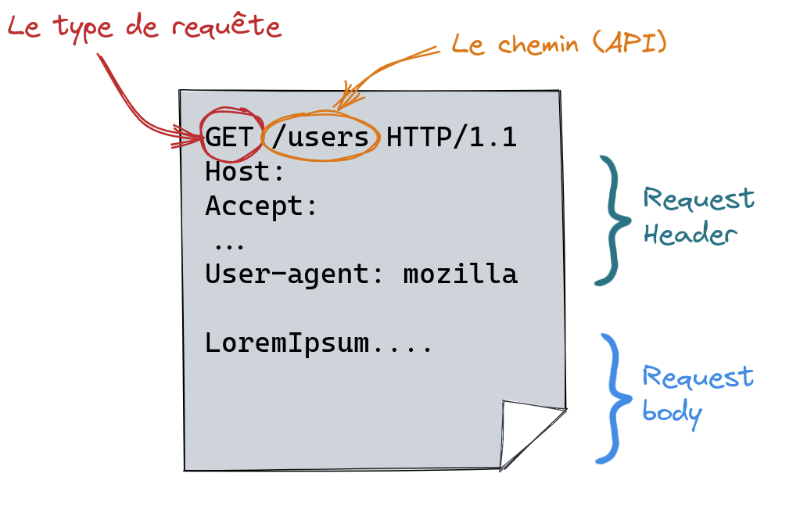
]

]
]

---

# Quel est le rôle du serveur ?

.center[

]

--

.center[🥱 Attendre et attendre et attendre ... 🥱]

--

Et de temps en temps 🥳 il doit traiter une requête !

---

class: center, middle

# Serveur et serveur deux choses différentes

**_Attention_** il y a deux significations à serveur ...

.center[

<iframe src="https://giphy.com/embed/xU9TT471DTGJq" width="480" height="365" frameBorder="0" class="giphy-embed" allowFullScreen></iframe>
]

---

# Serveur et serveur deux choses différentes

## Le serveur hardware

.center[

]

.center[C'est la machine **physique ou virtuelle** connectée au réseau qui va recevoir des paquets de données mais en aucun cas ne s'occupera du traitement de ces données]

---

# Serveur et serveur deux choses différentes

## Le serveur hardware : différents types

.center[Serveur physique vs serveur virtuel (VPS) ]

<div style="position: absolute; bottom: 15%; left: 15%">

</div>

--

<div style="position: absolute; bottom: 15%; right: 10%">
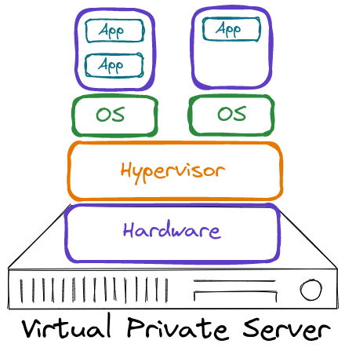
</div>

--

<div style="position: absolute; bottom: 10%; left: 20%">
Différentes solutions : On Premise vs Cloud (OVH, Azure, GCP, AWS, ... )
</div>

---

# Serveur et serveur deux choses différentes

## Le serveur "software"

.center[
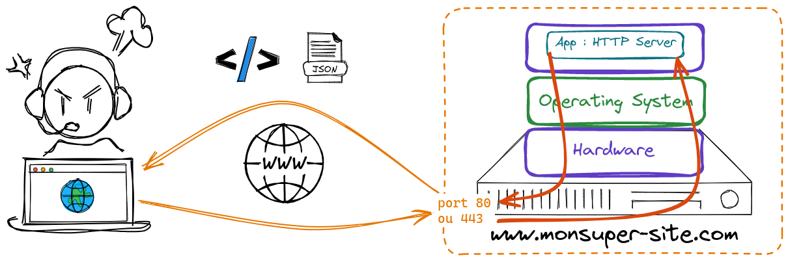
]

C'est l'application (au sens logiciel) qui va s'occuper de

.center[**Recevoir**, **Traiter** et **Répondre** aux requètes HTTP]

Différentes solutions : Apache (40%), Nginx (20%), IIS (10%), ...

.footnote[Source : [https://fr.hostadvice.com/marketshare/server/](https://fr.hostadvice.com/marketshare/server/) ]

---

# Héberger plusieurs serveurs HTTP(S) sur un même serveur physique ?

.center[OUI 🎯 il suffit de se partager le port 80 🤝]

.center[]

--

.center[Il suffit de configurer au niveau du serveur HTTP des **Virtual Host**]

--

<div style="position: absolute; top: 30%; left:15%">
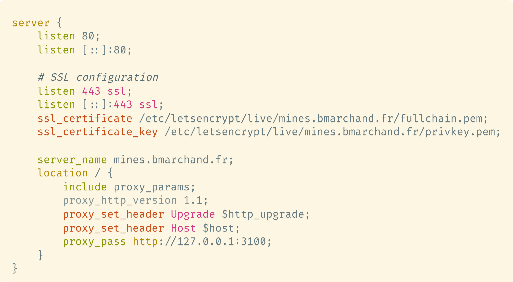
</div>

<div style="position: absolute; top: 30%; left:55%">
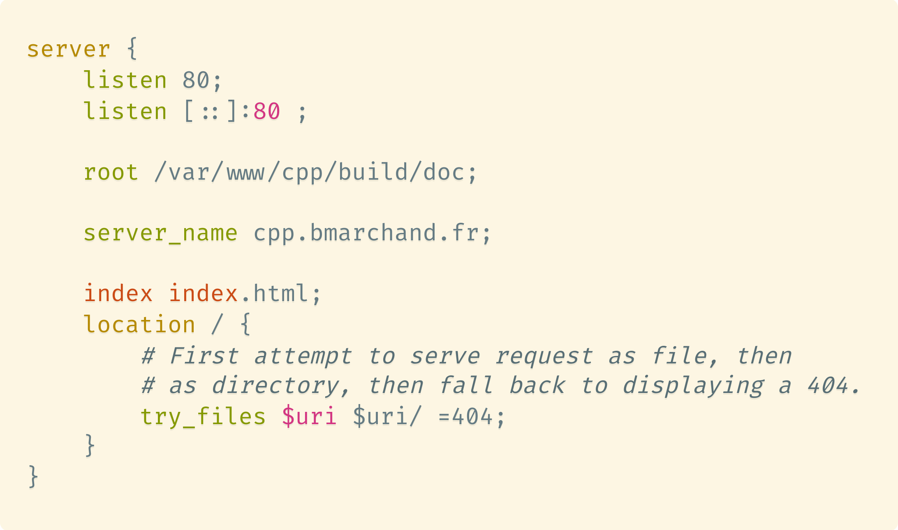
</div>

---

# Un mot sur le serverless

.center[Un serveur traditionnel passe son temps à attendre ...

🥱

]

.center[**_Un serveurless est un serveur qui n'attend pas_**]

Le principe est de découper le traitement en petites **tâches indépendantes** (fonctions) qui seront exécutées **à la demande**

.cols[
.fifty[

## Avantages

- Pas de gestion de serveur
- Pas de coût fixe
- Évolutif

]
.fifty[

## Inconvénients/Difficultés

- Temps de démarrage
- Coût à l'usage
- Difficulté de débogage
- Stateless

]
]

Coût plus faible pour les fournisseurs car ils peuvent optimiser l'utilisation des ressources

---

# Tous les serveurs font la même chose ?

**Deux applications**

.center[Sites statiques vs dynamiques]

.cols[
.fifty[

<iframe src="https://cpp.bmarchand.fr/controlSection.html" width="100%" height="400" frameBorder="0"></iframe>

    ]

.fifty[

<iframe width="600px" height="400px" src="https://xkcd.com" style="-moz-transform: scale(0.75);"></iframe>

    ]

]

---

# Site statique

.center[Le serveur http ne fait qu'une seule et unique chose
<br><br>
**_lire des fichiers_** html, png, jpg, pdf, .... et **_envoyer le contenu au client_**
]

<br><br>

.center[
<a href="http://cpp.bmarchand.fr" target="_blank"> 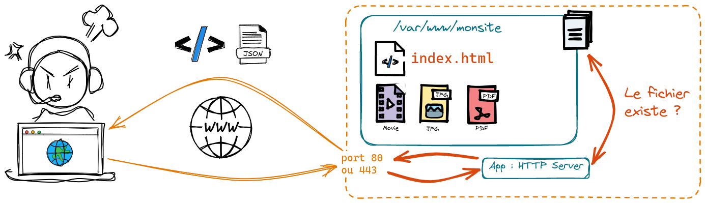</a>
]

---

# Site dynamique

.center[Le serveur http va devoir travailler avec d'autre service <br>afin de produire le résultat final pouvant être envoyé au client]

.center[
<a href="http://bmarchand.fr/research/activities" target="_blank">
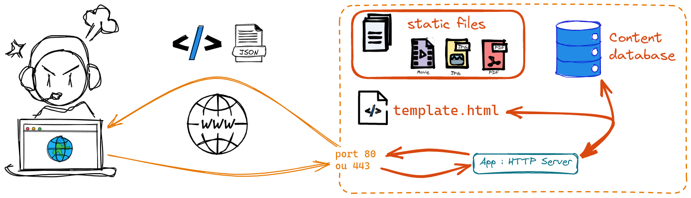
</a>
]

--

.center[
<a href="https://rep.mines-paristech.fr" target="_blank">

</a>
]

---

# Solutions d'hébergement gratuit

.cols[
.fifty[

## Sites statiques

- GitHub Pages
- GitLab Pages
- Netlify
- Vercel
- ...

]
.fifty[

## Sites dynamiques

- ~~Heroku~~
- Glitch
- Repl.it
- PythonAnywhere
- Vercel (serverless)
- ...

]

]

.center[Plein d'offres sur le marché, à vous de choisir celle qui vous convient le mieux]

Attention en revanche :

.center[**_Gratuit_** ne veut pas dire **_sans limite_**]

---

# Le serveur web : un besoin de perf 🚀

.center[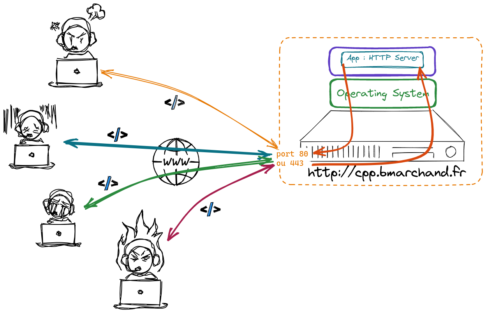]

<div style="position: absolute; bottom: 15s%; right: 10%;">
  .center[Comment faire pour que tout le monde <br><br>ait une réponse en un temps raisonnable ?<br>
  .⏳️]
</div>

---

# Solutions techniques

.center[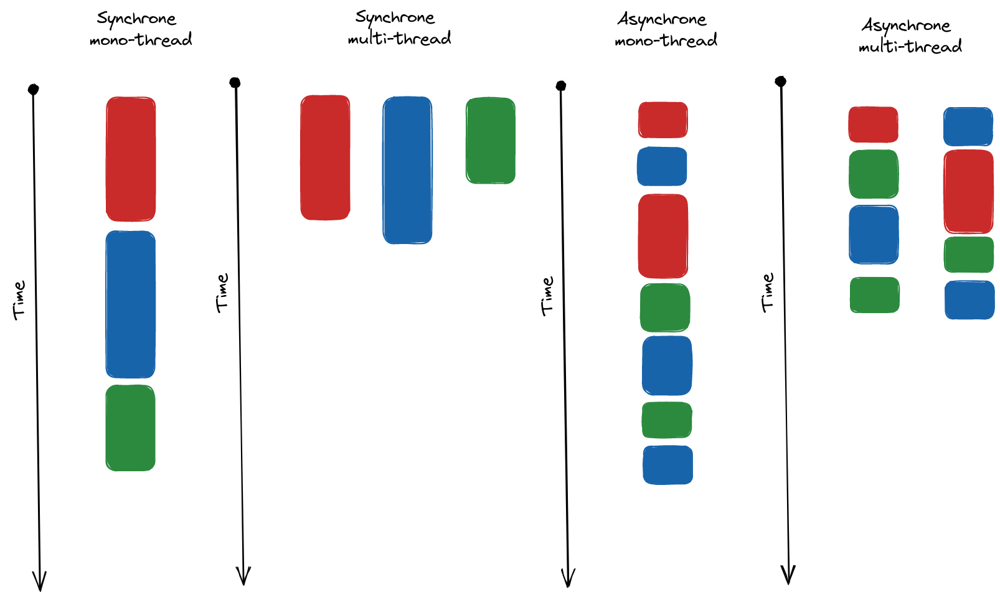]

.center[Utilisation du parallélisme de tâches processus/thread et/ou programmation asynchrone]

---

# Et au fait il répond quoi le serveur à GET ?

.cols[
.fifty[
.center[]
]
.fifty[
.center[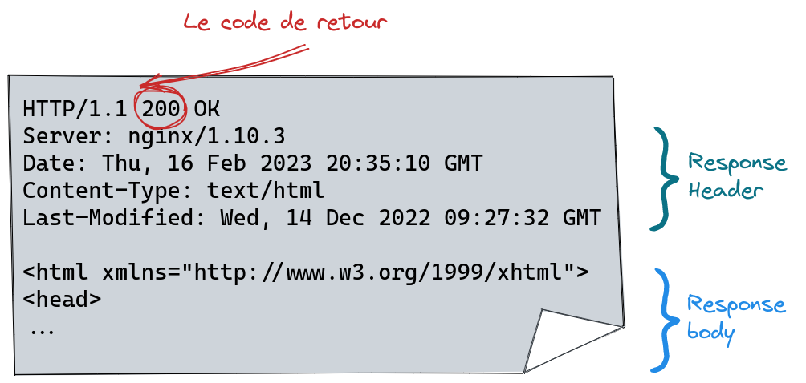]
]
]

Possible de voir les requêtes et réponses dans votre navigateur via

.center[`Outils de développement > Network`]

---

<!-- # Faisons un serveur http de base

.center[
[http://bit.ly/3EeuLLo](http://bit.ly/3EeuLLo)
]

.center[

]

📢 ⚠️ On regarde le fichier `minimal_server.py`

--- -->

# (Au passage c'est quoi mon IP ?)

Quand je suis un serveur comment je fais pour connaitre mon IP ?

Il suffit de demander à TEST-NET-1,2,3 :

.center[192.0.2.0 ou 198.51.100.0 ou 203.0.113.0]

```python
import socket
def find_my_ip():
    candidates = []
    for test_ip in ["192.0.2.0", "198.51.100.0", "203.0.113.0"]:
        s = socket.socket(socket.AF_INET, socket.SOCK_DGRAM)
        s.connect((test_ip, 80))
        ip_addr = s.getsockname()[0]
        s.close()
        if ip_addr in candidates:
            return ip_addr
        candidates.append(ip_addr)

    return candidates[0]
```

⚠️ `socket.SOCK_DGRAM` connexion via UDP et pas TCP

---

# Traitement des requêtes

Le fonctionnement interne d'un serveur HTTP est assez simple

1. **Écouter** sur un port (80 par défaut)
2. **Accepter** une connexion
3. **Lire** la requête
4. **Traiter** la requête
5. **Envoyer** la réponse
6. **Fermer** la connexion

Le point important est la transition entre les étapes 3 et 4 qui est le coeur du serveur HTTP
car définit la manière dont le serveur va traiter la requête.

---

# Exemple fait à la main

.center[
[http://bit.ly/3EeuLLo](http://bit.ly/3EeuLLo)
]

.center[

]

📢 ⚠️ On regarde les fichiers `more_advance_server.py` et `more_more_advance_server.py`

---

# Évidemment il existe des framework pour ça !

---

# Les framework

Réponse à un besoin mais lequel ?

.center[***Cadre de développement simplifié***]

En gros un guide <strike> spirituel </strike>, permettant de développer simplement des applications spécifiques.

.center[

<iframe src="https://giphy.com/embed/MZW5o8f5RaH0Q" width="480" height="197" frameBorder="0" class="giphy-embed" allowFullScreen></iframe>

]

---

# Framework vs Librairie

.center[Frameworks, Librairies, même chose ? <br> ]

--

.cols[
.fifty[
.center[<b> Librairies </b>]

Ensemble de programmes effectuant des opérations spécifiques, que vous allez utiliser de manière ponctuelle au sein de vos programmes en suivant votre propre logique.

<br>

Par exemple `NumPy` en Python 🐍 est une librairie

.center[
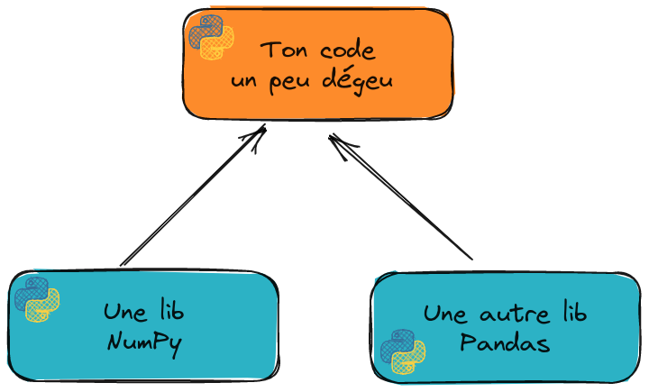
]

]
.vertbar[]
.fifty[
.center[<b> Framework </b>]

Cadre de développement dans lequel le développeur vient s'inscrire, i.e. développer des fonctionnalités/comportements. Là ce n'est plus le développeur qui fixe sa logique mais le framework.

<br>

Un code à trou 🕳️ en quelque sorte

.center[
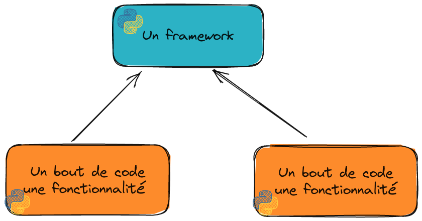
]

]
]

---

# Frontend, backend

.center[⚠️ Framework web un terme très, trop, générique ⚠️]

.cols[
.fifty[

.center[Framework frontend]

.center[

  
]

Focalisé sur le développement d'application côté client.

]
.vertbar[]
.fifty[

.center[Framework backend]

.center[

  
]

Focalisé sur le développement côté serveur

]
]

---

# Les grands principes des framework backend

.center[
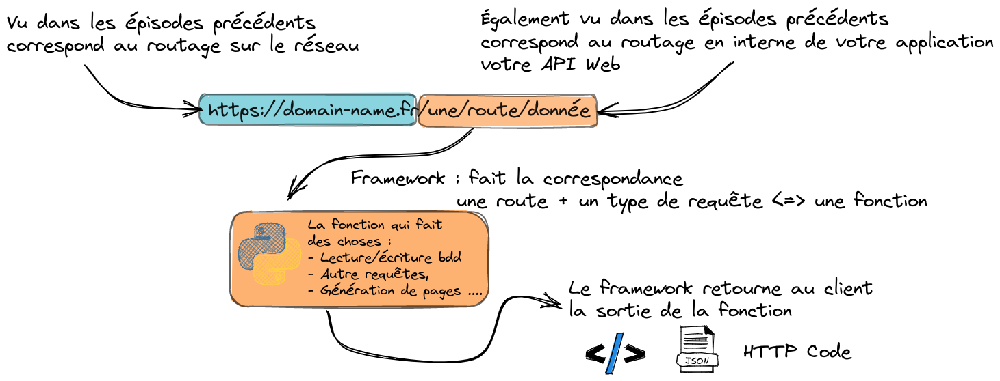
]

A cela un framework complet ajoute des fonctionnalités de :
.center[`Web Template`, `Sécurité`, `Accès à des bases de données`]

---

# Framework Flask

Micro-framework Python 🐍 développé depuis 2010.
<br><br>
.center[

]
<br><br>
🚧 Micro-framework ne veut pas dire pas utilisable sur des gros projets ⚠️
<br><br>
.center[
Pinterest, Airbnb, Trivago, ...
]
<br><br>
Micro-framework car noyau très léger et minimaliste mais pouvant être enrichi avec des extensions.

---

# Le setup de base

## Installation

```bash
pip install flask
```

--

## Minimal working example

```python
from flask import Flask
app = Flask(__name__)

@app.route('/')
def hello_world():
    return 'Hello, World!'

if __name__ == '__main__':
    app.run()
```

.center[
Une fois lancé -> [http://localhost:5000](http://localhost:5000)
]

.center[? C'est quoi .clignote[`@app.route('/')`] ?]

---

# Les routes

`@app.route` est un décorateur qui permet d'associer une fonction à une URL et un type de requête HTTP.

Dans sa version complète on peut écrire :

```python
@app.route('/hello', methods=['GET', 'POST'])
def hello():
  if request.method == 'POST':
    ## traitement
  elif request.method == 'GET':
    ## traitement
  else:
    return "Méthode non autorisée", 405
```

---

class: center, middle

# On a fini ...

<br><br>

--

# ... ou pas en fait

.center[<iframe src="https://giphy.com/embed/3ohs7XbAurbpO5jIBy" width="480" height="267" frameBorder="0" class="giphy-embed" allowFullScreen></iframe>]

---

# Petite pause mise en pratique

**Objectif** : Mettre en place une API permettant d'accéder au contenu de fichier CSV

Vous avez [https://github.com/ue22-p24/network-frontend-apitester](https://github.com/ue22-p24/network-frontend-apitester) un frontend tout fait !

Et vous avez [https://github.com/ue22-p24/network-backend-api-skeleton](https://github.com/ue22-p24/network-backend-api-skeleton) un backend à compléter

L'api du backend doit **impérativement** respecter les routes documentées dans le README.

---

# Un petit point sécurité 🔒

Quelle différence entre

.center[HTTP et HTTP**S**]

.center[❓]

--

.center[Oui oui c'est le **S** de **S**ecure 😓]

Grosso modo :

.center[
Enrobage du protocôle HTTP dans une couche de chiffrement <br><br><br>
pour garantir la sécurité de l'utilisateur
]

.center[]

---

# HTTP un truc pas safe ?

.cols[
.fifty[
***Alors oui le HTTP de base n'est pas sécurisé***
]
.fifty[
.center[

<iframe src="https://giphy.com/embed/1FMaabePDEfgk" width="200" height="200" frameBorder="0" class="giphy-embed" allowFullScreen></iframe>
]
]
]

--

.cols[
.fifty[
.center[

<iframe src="https://giphy.com/embed/dZA4cLPCvSs1s5aCm7" width="480" height="270" frameBorder="0" class="giphy-embed" allowFullScreen></iframe>
]
  ]
  .fifty[
    ***Mais ce n'est pas très grave dans pleins de cas***
]
]

---

# Le risque du HTTP

<br>

.cols[
.fifty[
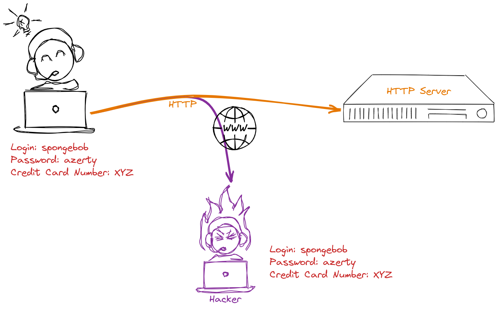
]
.fifty[

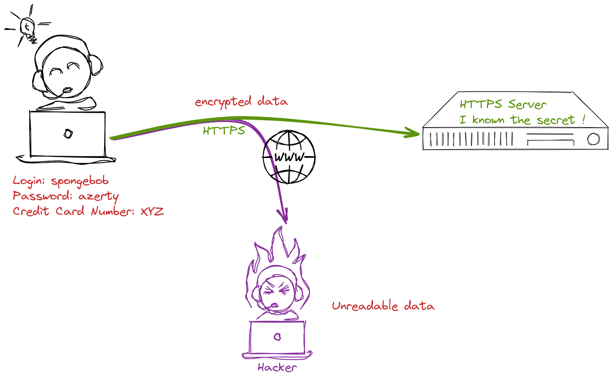

]
]

.center[Le principe est donc de renfermer la requête HTTP et les informations qu'elle contient <br><br> dans un message crypté]

---

# Principes de chiffrement

En pratique le chiffrement fonctionne avec un système clé publique/clé privée

.center[
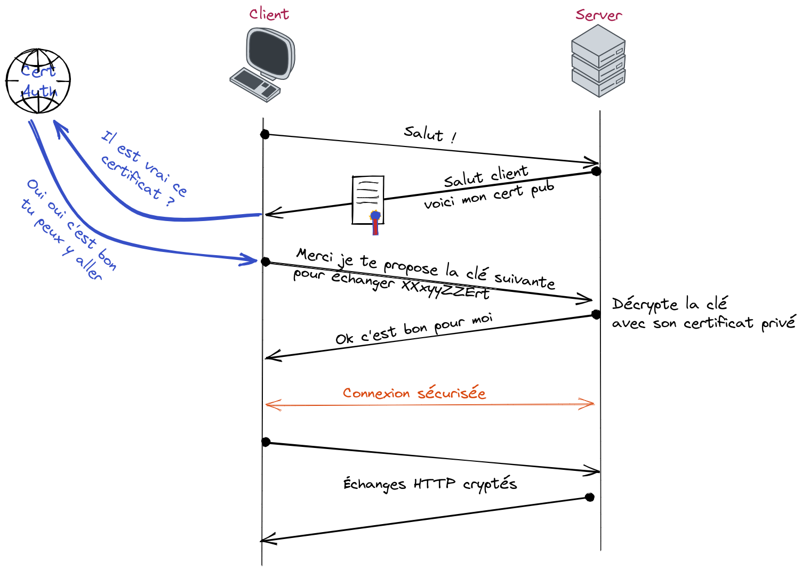
]

---

# Autorité de certification

.center[Tiers de confiance <br><br> qui va générer les certificats permettant le chiffrement et l'authentification de l'identité des correspondants]

Possible de générer ses propres certificat soi-même mais ils ne sont pas considérés comme valide par les clients standards.

.center[]

Pour générer des certificats gratuitement il existe l'initiative **Let's Encrypt**

.center[]

---

class: center, middle

# Et maintenant c'est fini ?

.center[<iframe src="https://giphy.com/embed/I1nwVpCaB4k36" width="400" height="400" frameBorder="0" class="giphy-embed" allowFullScreen></iframe>]

---

# Les cookies 🍪

Faisons une pause goûter 🤤

.center[

<iframe src="https://giphy.com/embed/3o6MbitgftpbGFP3B6" width="480" height="362" frameBorder="0" class="giphy-embed" allowFullScreen></iframe>
]

.center[
Ca fait parti de ces petites choses ***cachées*** dans le header des réponses http.
]

---

# Concrètement c'est quoi ?

Un 🍪 HTTP c'est
.center[données qu’un serveur envoie à un client]

.cols[
.fifty[
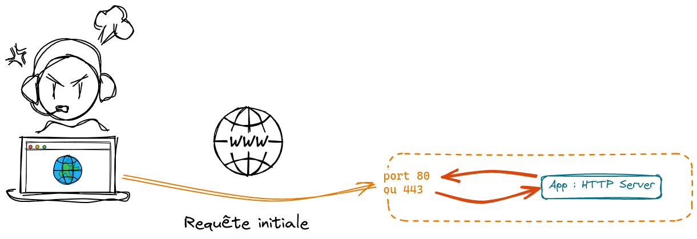
]
.fifty[
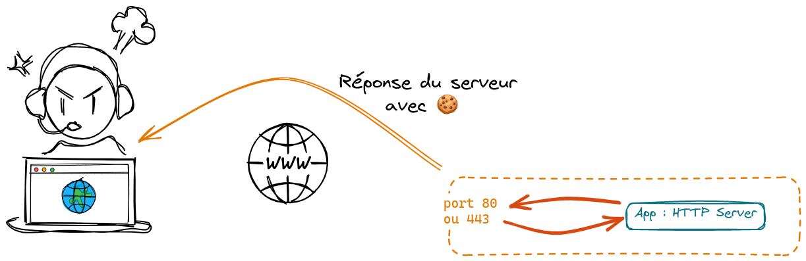
]
]

.center[stockée sur le client (dans le navigateur) <br> **renvoyée** au serveur à chaque nouvelle requête]

.center[ 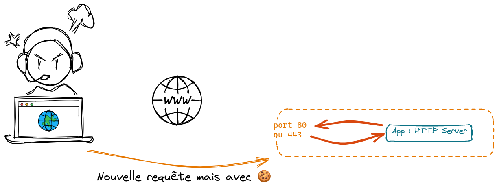]

---

# Quel intérêt ?

Les cookies sont là pour enrichir le HTTP.

.center[HTTP = protocole sans état]

En gros impossible pour un serveur HTTP de savoir si deux requètes viennent d'une même client ou pas 😵‍💫

.center[comment rester authentifier alors ?]

**_La solution_**

.center[Les cookies 🍪 parce que ça laisse des miettes]

Concrètement on va pouvoir stocker :

.center[Un session ID, des préférences utilisateur (light/dark theme, langue, ...)]

---

# Mettre des cookies

Rien de plus simple, dans l'en-tête de la réponse serveur à une requête client il suffit d'ajouter
<br><br>
.center[
`Set-Cookie: <name>=<value>; <attributs...>`
]
<br><br>
Attributs de Cookie

- `Expires` : durée de vie (date/heure)
- `Max-Age` : durée de vie (seconde)
- `Domain` : noms de domaine pour lesquels le cookie est renvoyé [par exemple](https://www.mat.minesparis.psl.eu)
- `Path` : chemin particulier pour lesquels le cookie est renvoyé
- `Secure` : si autorise ou pas l'envoie via HTTP et non HTTPS
- `HttpOnly` : si autorise ou pas l'accès via autre chose de du http(s)

---

# Quelques rêgles à suivre

.center[]
.center[https://www.cnil.fr/fr/cookies-et-autres-traceurs/regles/cookies](https://www.cnil.fr/fr/cookies-et-autres-traceurs/regles/cookies)

- Internautes doivent être informé et donner leur consentement avant le dépôt de certains cookies
  - ❌ Traçage publicitaire / réseaux sociaux
  - ✔️ Cookie pour dire qu'on refuse les cookies [exemple](https://cpp.bmarchand.fr), panier d'achat, authentification, ...
- Recueillir le consentement
  - Bouton refusé aussi visible que celui accepté
  - Possibilité de choisir les cookies
  - Facilité de retrait du consentement

---

# Rajoutons un Cookie dans notre serveur

.center[[http://bit.ly/410qbdD](http://bit.ly/410qbdD)]

.center[

]

---

# HTTP + 🍪 suffisant pour tout faire ?

.center[
<br><br>

<iframe src="https://giphy.com/embed/XymaJlgorUL8vOfF88" width="480" height="400" frameBorder="0" class="giphy-embed" allowFullScreen></iframe>
]

---

# Mais pourquoi ?

.cols[
.thirty[

]
.sixty[

    <br><br>

Fonctionnement de HTTP très rigide
<br><br>
.center[question/réponse]
<br><br>
Impossible pour le serveur d'être à l'origine de l'échange
.center[Assez limitant en fait 😮‍💨]

.cols[
.fifty[
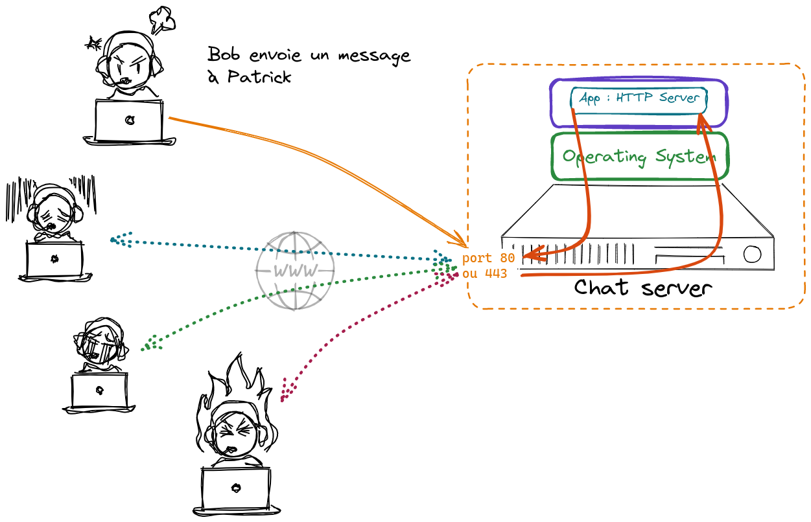
]
.fifty[
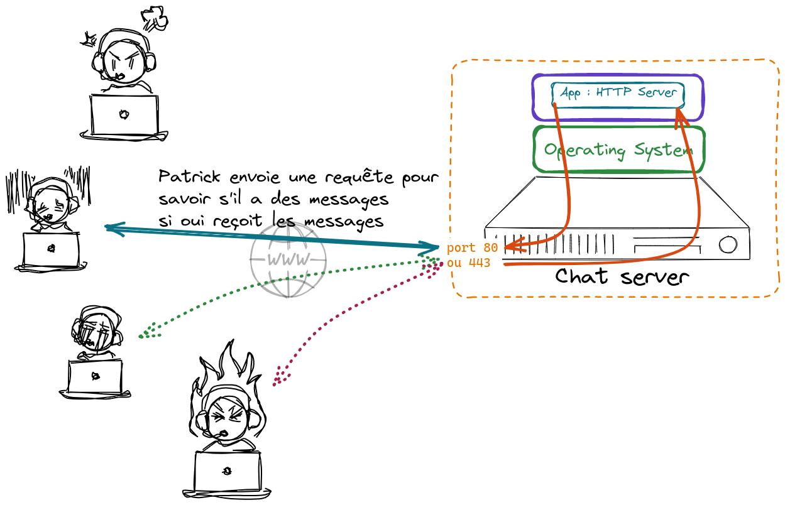

]

]

]
]

---

# Websocket

.center[En 2011 révolution arrivée de Websocket 🤯]

.cols[
.fifty[
<br><br>
.center[connexion **bidirectionnelle** entre un client et le serveur
<br><br>on parle de connexion *full-duplex*
<br><br>Permet au serveur de ***pousser*** des informations vers le client sans que ce dernier n'est rien demandé 😲
]
]
.fifty[
.center[]
]
]

---

# Comment ça marche

Très simplement en fait !

.center[Première étape on établie une connexion vers un serveur WebSocket <br> via <br>
`ws://mon-super-server.com` ou `wss://mon-super-server.com`
]

.center[Une fois la connexion établie <br><br>on doit simplement se mettre en état d'écoute à des évènements particuliers]

Quatre types d'évènements

.center[`onopen` 📖, `onclose` 📕, `onerror` 🚨, `onmessage` 📥]

Et à chaque évènement on va venir associer une action

---

# Par exemple :

.cols[
.fifty[

```javascript
var socket = new WebSocket("ws://localhost:3060/ws");

socket.onopen = function (e) {
  alert("[open] Connection established");
  alert("Sending to server");
  socket.send("My name is John");
};

socket.onmessage = function (event) {
  alert(`[message] Data received from server: ${event.data}`);
};

socket.onclose = function (event) {
  if (event.wasClean) {
    alert(
      `[close] Connection closed cleanly,
      code=${event.code} reason=${event.reason}`
    );
  } else {
    // e.g. server process killed or network down
    // event.code is usually 1006 in this case
    alert("[close] Connection died");
  }
};

socket.onerror = function (error) {
  alert(`[error] ${error.message}`);
};
```

]
.fifty[

```python
from tornado.websocket import websocket_connect

def on_message( msg ):
    print(f"[In on message] {msg}")

ws = await websocket_connect("ws://localhost:3060/ws",
  on_message_callback=on_message)

await ws.write_message("coucou")
await ws.write_message("byebye")
await ws.write_message("vive la MMC")

```

⚠️ Vous voyez apparaître le mot clé `await` que vous ne connaissez pas en Python 🐍

C'est lié à la programmation asynchrone. Pour plus de détails je vous encourage à faire un tour sur le Mooc

.center[*Python : des fondamentaux aux concepts avancés du langage*]

]
]

---

# En pratique

## Une messagerie instantannée !

.center[[http://bit.ly/3xu599H](http://bit.ly/3xu599H)]

.center[

]

---

# In the next episode

.cols[
.fifty[
.center[<iframe src="https://giphy.com/embed/xTiTnBdvZgewvjTBAs" width="400" height="400" frameBorder="0" class="giphy-embed" allowFullScreen></iframe>]
]
.fifty[
.center[<iframe src="https://giphy.com/embed/RbSmVaVGptW03Wjw3a" width="480" height="400" frameBorder="0" class="giphy-embed" allowFullScreen></iframe>]
]
]

.center[Un tour d'horizon du **Framework `Flask`** <br>
qui va vous simplifier la vie pour tous les développements Web]
